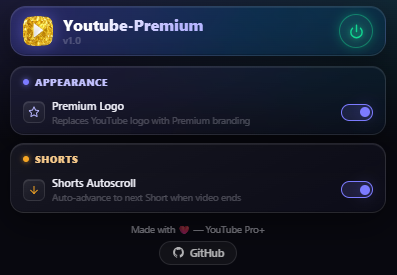

  
  <h1>Youtube-Premium</h1>

  
  

A lightweight YouTube extension that adds Premium branding, extended speed controls, and auto-scrolling for Shorts.

---

## Screenshot

  

---

## Features

* **Premium Logo** — Replaces the standard YouTube logo with the YouTube Premium logo.
* **Speed Booster** — Bypasses YouTube's 2x speed limit. Control playback speed up to 10x from the native player settings.
* **Shorts Autoscroll** — Automatically advances to the next Short when the current one ends.

---

## Installation

1. Download or clone this repository.
2. Open `chrome://extensions/` (or `edge://extensions/` / `brave://extensions/`).
3. Enable **Developer mode**.
4. Click **Load unpacked** and select this folder.
5. Refresh YouTube.

---

## Disclaimer

This extension modifies YouTube's DOM and playback variables. If YouTube updates their interface, features may temporarily stop working until selectors are updated.

---

Copyright &copy; 2026 debraj-80

